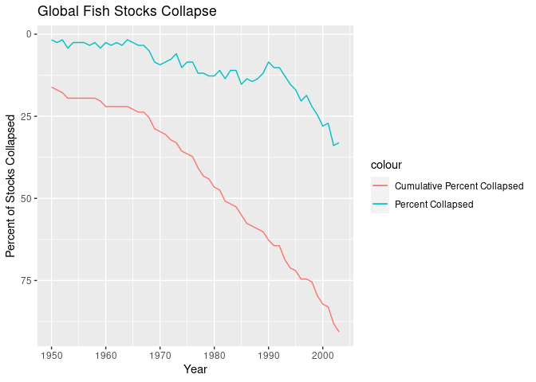

``` r
library(tidyverse)
library(readxl)
```

``` r
#download.file("https://zenodo.org/record/7814638/files/RAMLDB%20v4.61.zip?download=1", "fish.zip")
download.file("https://minio.carlboettiger.info/shared-data/ram.zip", "fish.zip")
```

``` r
unzip("fish.zip")
unlink(list.files(".", pattern = "[.]zip"))
```

# Unit 2: Fisheries Collapse Module

This module will focus on understanding and replicating fisheries stock
assessment data and fisheries collapse.

Instead of working with independent data.frames, we will be working with
a large relational database which contains many different tables of
different sizes and shapes, but that all all related to each other
through a series of different ids.

## The Database

We will use data from the [RAM Legacy Stock Assessment
Database](https://www.ramlegacy.org/database/)

# Exercise 1: Investigating the North-Atlantic Cod

First, We seek to replicate the following figure from the Millennium
Ecosystem Assessment Project using the RAM data.

``` r
#!(http://espm-157.carlboettiger.info/img/cod.jpg)
```


``` r
mcatch<-read_csv("RAMCore/MCatch.csv")
```

    ## New names:
    ## Rows: 71 Columns: 1064
    ## ── Column specification
    ## ──────────────────────────────────────────────────────── Delimiter: "," dbl
    ## (1050): ...1, ACADRED2J3K, ACADREDGOMGB, ACADREDUT3, ACMACKSARG, AFLONCH... lgl
    ## (14): BNOSESHARATL, BSKATCANATL, BTIPSHARATL, BTIPSHARGM, CUSK4X, DOYS...
    ## ℹ Use `spec()` to retrieve the full column specification for this data. ℹ
    ## Specify the column types or set `show_col_types = FALSE` to quiet this message.
    ## • `` -> `...1`

``` r
mcatch
```

    ## # A tibble: 71 × 1,064
    ##     ...1 ACADRED2J3K ACADREDGOMGB ACADREDUT3 ACMACKSARG AFLONCH   ALBAIO ALBAMED
    ##    <dbl>       <dbl>        <dbl>      <dbl>      <dbl>   <dbl>    <dbl>   <dbl>
    ##  1  1950          NA        34300         NA         NA      NA     8.15       0
    ##  2  1951          NA        30100         NA         NA      NA    18.4        0
    ##  3  1952          NA        21400         NA         NA      NA    80          0
    ##  4  1953          NA        16800         NA         NA      NA  1110          0
    ##  5  1954          NA        13000         NA         NA      NA  2850          0
    ##  6  1955          NA        13900         NA         NA      NA  3360          0
    ##  7  1956          NA        14400         NA         NA      NA  5630          0
    ##  8  1957          NA        18500         NA         NA      NA  5340       1700
    ##  9  1958          NA        16000         NA         NA      NA  7300       2900
    ## 10  1959          NA        15500         NA         NA      NA 11700       2900
    ## # ℹ 61 more rows
    ## # ℹ 1,056 more variables: ALBANATL <dbl>, ALBANPAC <dbl>, ALBASATL <dbl>,
    ## #   ALBASPAC <dbl>, ALPLAICBSAI <dbl>, ALSKABSAI <dbl>, AMPL23K <dbl>,
    ## #   AMPL3LNO <dbl>, AMPL3M <dbl>, AMPL3Ps <dbl>, AMPL4T <dbl>, AMPL4VWX <dbl>,
    ## #   AMPL5YZ <dbl>, ANCHIXa <dbl>, ANCHMEDGSA1 <dbl>, ANCHMEDGSA16 <dbl>,
    ## #   `ANCHMEDGSA17-18` <dbl>, ANCHMEDGSA19 <dbl>, ANCHMEDGSA20 <dbl>,
    ## #   `ANCHMEDGSA22-23` <dbl>, ANCHMEDGSA29 <dbl>, ANCHMEDGSA6 <dbl>, …

Here we read in all the necessary sheets from the dataset.

``` r
xlsx<-"Excel/RAMLDB v4.61 (assessment data only).xlsx"
readxl::excel_sheets(xlsx)
```

    ##  [1] "area"                         "assessment"                  
    ##  [3] "assessmethod"                 "assessor"                    
    ##  [5] "biometrics"                   "bioparams"                   
    ##  [7] "bioparams_assessments_views"  "bioparams_ids_views"         
    ##  [9] "bioparams_notes_views"        "bioparams_sources_views"     
    ## [11] "bioparams_units_views"        "bioparams_values_views"      
    ## [13] "management"                   "stock"                       
    ## [15] "taxonomy"                     "timeseries.1"                
    ## [17] "timeseries.2"                 "timeseries_assessments_views"
    ## [19] "timeseries_ids_views"         "timeseries_notes_views"      
    ## [21] "timeseries_sources_views"     "timeseries_units_views"      
    ## [23] "timeseries_values_views"      "timeseries_years_views"      
    ## [25] "tsmetrics"

``` r
ts1<-read_xlsx(xlsx, sheet="timeseries.1")
ts2<-read_xlsx(xlsx, sheet="timeseries.2")
area<- read_xlsx(xlsx, sheet= "area")
stock<- read_xlsx(xlsx, sheet= "stock")
metrics<- read_xlsx(xlsx, sheet= "tsmetrics")
metrics
```

    ## # A tibble: 452 × 6
    ##    tscategory             tsshort       tslong tsunitsshort tsunitslong tsunique
    ##    <chr>                  <chr>         <chr>  <chr>        <chr>       <chr>   
    ##  1 OTHER TIME SERIES DATA AQ            Aquac… MT           metric tons AQ-MT   
    ##  2 OTHER TIME SERIES DATA ASP           Annua… MT           Metric tons ASP-MT  
    ##  3 TOTAL BIOMASS          BdivBmgtpref  Gener… dimensionle… dimensionl… BdivBmg…
    ##  4 TOTAL BIOMASS          BdivBmgttouse Gener… dimensionle… dimensionl… BdivBmg…
    ##  5 TOTAL BIOMASS          BdivBmsypref  Gener… dimensionle… dimensionl… BdivBms…
    ##  6 TOTAL BIOMASS          BdivBmsytouse Gener… dimensionle… dimensionl… BdivBms…
    ##  7 OTHER TIME SERIES DATA BYCAT         Indus… MT           Metric tons BYCAT-MT
    ##  8 CATCH or LANDINGS      Cadvised-CMB  Scien… MT           Metric tons Cadvise…
    ##  9 CATCH or LANDINGS      Cadvised      Scien… MT           Metric tons Cadvise…
    ## 10 CATCH or LANDINGS      CdivMEANC     Catch… ratio        ratio       CdivMEA…
    ## # ℹ 442 more rows

``` r
assess<- read_xlsx(xlsx, sheet="assessment")
```

Here we combined both “timeseries” datasheets (timeseries.1 and
timeseries.2) and filtered them by TCbest-MT (Total catch in metric
tons)

``` r
ts<-bind_rows(ts1, ts2) |> 
  distinct()|> 
  filter(tsid=="TCbest-MT")
```

We want to see the most recent stock data for Atlantic Cod. This table
displays all the assessid of the Atlantic cod.

``` r
most_recent<-
  assess|>
  left_join(stock) |>
  filter(commonname=="Atlantic cod")|>
  filter(mostrecent==999)|>
  select(assessid)
```

    ## Joining with `by = join_by(stockid, stocklong)`

``` r
most_recent
```

    ## # A tibble: 27 × 1
    ##    assessid                               
    ##    <chr>                                  
    ##  1 AFWG-CODNEAR-1946-2020-ICESIMP2021-2   
    ##  2 AFWG-CODNEARNCW-1984-2019-ICESIMP2021-2
    ##  3 DFO-MAR-COD4VsW-1958-2002-PREFONTAINE  
    ##  4 DFO-MAR-COD4X5Yb-1960-2018-ASHBROOK    
    ##  5 DFO-NFLD-COD2J3KL-1959-2018-ASHBROOK   
    ##  6 DFO-NFLD-COD3Ps-1959-2018-ASHBROOK     
    ##  7 DFO-QUE-COD3Pn4RS-1964-2019-ASHBROOK   
    ##  8 DFO-SG-COD4TVn-1917-2018-ASHBROOK      
    ##  9 NAFO-SC-COD3M-1960-2012-CHING          
    ## 10 NAFO-SC-COD3NO-1953-2011-CHING         
    ## # ℹ 17 more rows

We are looking at all the CATCH or LANDINGS in Metric tons from the
“metrics” data sheet.

``` r
units<-metrics |> 
  filter(tscategory=="CATCH or LANDINGS") |>
  filter(tsunitslong=="Metric tons")
units
```

    ## # A tibble: 37 × 6
    ##    tscategory        tsshort      tslong       tsunitsshort tsunitslong tsunique
    ##    <chr>             <chr>        <chr>        <chr>        <chr>       <chr>   
    ##  1 CATCH or LANDINGS Cadvised-CMB Scientific … MT           Metric tons Cadvise…
    ##  2 CATCH or LANDINGS Cadvised     Scientific … MT           Metric tons Cadvise…
    ##  3 CATCH or LANDINGS Cpair-CMB    Catch or la… MT           Metric tons Cpair-C…
    ##  4 CATCH or LANDINGS Cpair        Catch or la… MT           Metric tons Cpair-MT
    ##  5 CATCH or LANDINGS CUSTC        Customary c… MT           Metric tons CUSTC-MT
    ##  6 CATCH or LANDINGS ILLC         Illegal cat… MT           Metric tons ILLC-MT 
    ##  7 CATCH or LANDINGS RecC         Recreationa… MT           Metric tons RecC-MT 
    ##  8 CATCH or LANDINGS TAC-1        Total allow… MT           Metric tons TAC-1-MT
    ##  9 CATCH or LANDINGS TAC-2        Total allow… MT           Metric tons TAC-2-MT
    ## 10 CATCH or LANDINGS TAC-A1       Total allow… MT           Metric tons TAC-A1-…
    ## # ℹ 27 more rows

Next, we are combining the ts table with the “metrics” table we just
created and reassigned “tsid” to the “tsunique” column.

``` r
ts<-ts|> left_join(metrics, by=c("tsid"="tsunique"))
ts
```

    ## # A tibble: 122,255 × 11
    ##    assessid     stockid stocklong tsid  tsyear tsvalue tscategory tsshort tslong
    ##    <chr>        <chr>   <chr>     <chr>  <dbl>   <dbl> <chr>      <chr>   <chr> 
    ##  1 ABARES-BGRD… BGRDRSE Blue gre… TCbe…   1960      NA CATCH or … TCbest  Gener…
    ##  2 ABARES-BGRD… BGRDRSE Blue gre… TCbe…   1961      NA CATCH or … TCbest  Gener…
    ##  3 ABARES-BGRD… BGRDRSE Blue gre… TCbe…   1962      NA CATCH or … TCbest  Gener…
    ##  4 ABARES-BGRD… BGRDRSE Blue gre… TCbe…   1963      NA CATCH or … TCbest  Gener…
    ##  5 ABARES-BGRD… BGRDRSE Blue gre… TCbe…   1964      NA CATCH or … TCbest  Gener…
    ##  6 ABARES-BGRD… BGRDRSE Blue gre… TCbe…   1965      NA CATCH or … TCbest  Gener…
    ##  7 ABARES-BGRD… BGRDRSE Blue gre… TCbe…   1966      NA CATCH or … TCbest  Gener…
    ##  8 ABARES-BGRD… BGRDRSE Blue gre… TCbe…   1967      NA CATCH or … TCbest  Gener…
    ##  9 ABARES-BGRD… BGRDRSE Blue gre… TCbe…   1968      NA CATCH or … TCbest  Gener…
    ## 10 ABARES-BGRD… BGRDRSE Blue gre… TCbe…   1969      NA CATCH or … TCbest  Gener…
    ## # ℹ 122,245 more rows
    ## # ℹ 2 more variables: tsunitsshort <chr>, tsunitslong <chr>

Because we want to observe the regions in the East Coast, we decided to
filter the “area” sheet by country (Canada) and subsequently by the
distinct number of areacodes within Canada (there are 207 total).

``` r
area |> 
  filter(country == "Canada") |>
  distinct(country, areacode)
```

    ## # A tibble: 207 × 2
    ##    country areacode   
    ##    <chr>   <chr>      
    ##  1 Canada  23K        
    ##  2 Canada  2G-3K      
    ##  3 Canada  2HJ        
    ##  4 Canada  2HJ3KLNOP4R
    ##  5 Canada  2J         
    ##  6 Canada  2J3K       
    ##  7 Canada  2J3K-3LNO  
    ##  8 Canada  2J3KL      
    ##  9 Canada  2J3KLNOPs  
    ## 10 Canada  3K         
    ## # ℹ 197 more rows

We then created a table that is based on the ts data joined with the
metrics, stock, and area. This allows us to create a comprehensive list
of all species with their multiple identifiers.

``` r
fish <- ts|> 
  left_join(metrics, by=c("tsid"="tsunique"))|>
  left_join(stock)|>
  left_join(area)
```

    ## Joining with `by = join_by(stockid, stocklong)`
    ## Joining with `by = join_by(areaid)`

``` r
fish
```

    ## # A tibble: 122,255 × 34
    ##    assessid        stockid stocklong tsid  tsyear tsvalue tscategory.x tsshort.x
    ##    <chr>           <chr>   <chr>     <chr>  <dbl>   <dbl> <chr>        <chr>    
    ##  1 ABARES-BGRDRSE… BGRDRSE Blue gre… TCbe…   1960      NA CATCH or LA… TCbest   
    ##  2 ABARES-BGRDRSE… BGRDRSE Blue gre… TCbe…   1961      NA CATCH or LA… TCbest   
    ##  3 ABARES-BGRDRSE… BGRDRSE Blue gre… TCbe…   1962      NA CATCH or LA… TCbest   
    ##  4 ABARES-BGRDRSE… BGRDRSE Blue gre… TCbe…   1963      NA CATCH or LA… TCbest   
    ##  5 ABARES-BGRDRSE… BGRDRSE Blue gre… TCbe…   1964      NA CATCH or LA… TCbest   
    ##  6 ABARES-BGRDRSE… BGRDRSE Blue gre… TCbe…   1965      NA CATCH or LA… TCbest   
    ##  7 ABARES-BGRDRSE… BGRDRSE Blue gre… TCbe…   1966      NA CATCH or LA… TCbest   
    ##  8 ABARES-BGRDRSE… BGRDRSE Blue gre… TCbe…   1967      NA CATCH or LA… TCbest   
    ##  9 ABARES-BGRDRSE… BGRDRSE Blue gre… TCbe…   1968      NA CATCH or LA… TCbest   
    ## 10 ABARES-BGRDRSE… BGRDRSE Blue gre… TCbe…   1969      NA CATCH or LA… TCbest   
    ## # ℹ 122,245 more rows
    ## # ℹ 26 more variables: tslong.x <chr>, tsunitsshort.x <chr>,
    ## #   tsunitslong.x <chr>, tscategory.y <chr>, tsshort.y <chr>, tslong.y <chr>,
    ## #   tsunitsshort.y <chr>, tsunitslong.y <chr>, tsn <dbl>, scientificname <chr>,
    ## #   commonname <chr>, areaid <chr>, region <chr>, primary_country <chr>,
    ## #   primary_FAOarea <dbl>, ISO3_code <chr>, GRSF_uuid <chr>, GRSF_areaid <chr>,
    ## #   inmyersdb <dbl>, myersstockid <chr>, state <chr>, country <chr>, …

We want to only examine Atlantic cod as we are replicating the results
from papers that looked into the collapse of Atlantic cod (Gadus
morhua). To do this, we created a new table that only looked at Canadian
cod by filtering by the scientific name and country. Afterwards, we
joined that to the “most_recent” table as it contains information of the
stock data Atlantic cod in Canada.

``` r
cod <- fish |> 
  filter(scientificname == "Gadus morhua") |>
  filter(country == "Canada") |>
  inner_join(most_recent, by = "assessid") 
cod
```

    ## # A tibble: 378 × 34
    ##    assessid        stockid stocklong tsid  tsyear tsvalue tscategory.x tsshort.x
    ##    <chr>           <chr>   <chr>     <chr>  <dbl>   <dbl> <chr>        <chr>    
    ##  1 DFO-MAR-COD4Vs… COD4VsW Atlantic… TCbe…   1958   38600 CATCH or LA… TCbest   
    ##  2 DFO-MAR-COD4Vs… COD4VsW Atlantic… TCbe…   1959   66000 CATCH or LA… TCbest   
    ##  3 DFO-MAR-COD4Vs… COD4VsW Atlantic… TCbe…   1960   50600 CATCH or LA… TCbest   
    ##  4 DFO-MAR-COD4Vs… COD4VsW Atlantic… TCbe…   1961   66300 CATCH or LA… TCbest   
    ##  5 DFO-MAR-COD4Vs… COD4VsW Atlantic… TCbe…   1962   65200 CATCH or LA… TCbest   
    ##  6 DFO-MAR-COD4Vs… COD4VsW Atlantic… TCbe…   1963   68200 CATCH or LA… TCbest   
    ##  7 DFO-MAR-COD4Vs… COD4VsW Atlantic… TCbe…   1964   63300 CATCH or LA… TCbest   
    ##  8 DFO-MAR-COD4Vs… COD4VsW Atlantic… TCbe…   1965   71000 CATCH or LA… TCbest   
    ##  9 DFO-MAR-COD4Vs… COD4VsW Atlantic… TCbe…   1966   68500 CATCH or LA… TCbest   
    ## 10 DFO-MAR-COD4Vs… COD4VsW Atlantic… TCbe…   1967   54200 CATCH or LA… TCbest   
    ## # ℹ 368 more rows
    ## # ℹ 26 more variables: tslong.x <chr>, tsunitsshort.x <chr>,
    ## #   tsunitslong.x <chr>, tscategory.y <chr>, tsshort.y <chr>, tslong.y <chr>,
    ## #   tsunitsshort.y <chr>, tsunitslong.y <chr>, tsn <dbl>, scientificname <chr>,
    ## #   commonname <chr>, areaid <chr>, region <chr>, primary_country <chr>,
    ## #   primary_FAOarea <dbl>, ISO3_code <chr>, GRSF_uuid <chr>, GRSF_areaid <chr>,
    ## #   inmyersdb <dbl>, myersstockid <chr>, state <chr>, country <chr>, …

We are trying to find the specific stock used to generate the graphs in
the published data. To do this, we filtered the data via stockid and
areaid. In this case the relevant area ID was Canada-DFO-2J3KL.

``` r
cod_2J3KL <- fish |>
  filter(scientificname == "Gadus morhua") |>
  filter(stockid == "COD2J3KL") |>
  filter(areaid == "Canada-DFO-2J3KL") |>
  inner_join(most_recent, by = "assessid")
cod_2J3KL
```

    ## # A tibble: 59 × 34
    ##    assessid        stockid stocklong tsid  tsyear tsvalue tscategory.x tsshort.x
    ##    <chr>           <chr>   <chr>     <chr>  <dbl>   <dbl> <chr>        <chr>    
    ##  1 DFO-NFLD-COD2J… COD2J3… Atlantic… TCbe…   1959 363510. CATCH or LA… TCbest   
    ##  2 DFO-NFLD-COD2J… COD2J3… Atlantic… TCbe…   1960 463788. CATCH or LA… TCbest   
    ##  3 DFO-NFLD-COD2J… COD2J3… Atlantic… TCbe…   1961 506407. CATCH or LA… TCbest   
    ##  4 DFO-NFLD-COD2J… COD2J3… Atlantic… TCbe…   1962 506407. CATCH or LA… TCbest   
    ##  5 DFO-NFLD-COD2J… COD2J3… Atlantic… TCbe…   1963 511421. CATCH or LA… TCbest   
    ##  6 DFO-NFLD-COD2J… COD2J3… Atlantic… TCbe…   1964 601671. CATCH or LA… TCbest   
    ##  7 DFO-NFLD-COD2J… COD2J3… Atlantic… TCbe…   1965 546518. CATCH or LA… TCbest   
    ##  8 DFO-NFLD-COD2J… COD2J3… Atlantic… TCbe…   1966 518942. CATCH or LA… TCbest   
    ##  9 DFO-NFLD-COD2J… COD2J3… Atlantic… TCbe…   1967 611699. CATCH or LA… TCbest   
    ## 10 DFO-NFLD-COD2J… COD2J3… Atlantic… TCbe…   1968 814763. CATCH or LA… TCbest   
    ## # ℹ 49 more rows
    ## # ℹ 26 more variables: tslong.x <chr>, tsunitsshort.x <chr>,
    ## #   tsunitslong.x <chr>, tscategory.y <chr>, tsshort.y <chr>, tslong.y <chr>,
    ## #   tsunitsshort.y <chr>, tsunitslong.y <chr>, tsn <dbl>, scientificname <chr>,
    ## #   commonname <chr>, areaid <chr>, region <chr>, primary_country <chr>,
    ## #   primary_FAOarea <dbl>, ISO3_code <chr>, GRSF_uuid <chr>, GRSF_areaid <chr>,
    ## #   inmyersdb <dbl>, myersstockid <chr>, state <chr>, country <chr>, …

## \###Determining which Canadian cod stocks are considered collapsed

Once we determine the relevant stock in the specific area, we need to
determine during which years the stock collapsed. In this case,
collapsed is determined by whether the total catch was less than 10% of
the historical maximum. However, the historical maximum is contingent to
the time span of the data.

``` r
collapse<-cod_2J3KL |> 
  select(tsyear, tsvalue, stockid, areaid) |>
  mutate(collapsed = tsvalue < 0.1*max(tsvalue, na.rm=TRUE))
collapse
```

    ## # A tibble: 59 × 5
    ##    tsyear tsvalue stockid  areaid           collapsed
    ##     <dbl>   <dbl> <chr>    <chr>            <lgl>    
    ##  1   1959 363510. COD2J3KL Canada-DFO-2J3KL FALSE    
    ##  2   1960 463788. COD2J3KL Canada-DFO-2J3KL FALSE    
    ##  3   1961 506407. COD2J3KL Canada-DFO-2J3KL FALSE    
    ##  4   1962 506407. COD2J3KL Canada-DFO-2J3KL FALSE    
    ##  5   1963 511421. COD2J3KL Canada-DFO-2J3KL FALSE    
    ##  6   1964 601671. COD2J3KL Canada-DFO-2J3KL FALSE    
    ##  7   1965 546518. COD2J3KL Canada-DFO-2J3KL FALSE    
    ##  8   1966 518942. COD2J3KL Canada-DFO-2J3KL FALSE    
    ##  9   1967 611699. COD2J3KL Canada-DFO-2J3KL FALSE    
    ## 10   1968 814763. COD2J3KL Canada-DFO-2J3KL FALSE    
    ## # ℹ 49 more rows

The following code replicates what was done previously, but instead of
filtering by area ID, we determined the correct stock through trial and
error of the area names. From there, we added the most recent data
table, which contained information about total catch amounts. We then
plotted this data by year and total catch. It should be noted that the
original graph from the Millennium Ecosystem Assessment contains data
from 1850 to 2000. Since we filtered the data earlier to the more recent
values, our graph starts in 1950. Data from before 1950 excluded because
it is not considered as reliable. The graph is the same as the one that
would be produced from the area ID data, but instead is filtered by area
name.

``` r
cod |>
  filter(scientificname == "Gadus morhua") |>
  filter(areaname == "Southern Labrador-Eastern Newfoundland") |>
  inner_join(most_recent, by = "assessid") |>
  group_by(tsyear) |>
  summarise(total = sum(tsvalue, na.rm = TRUE)) |>
  ggplot(mapping=aes(tsyear, total)) + geom_point() + geom_line()
```

<!-- -->

Like the original graph, Atlantic cod stock peaks in the late 1960s and
begins to decline, with stocks almost entirely collapsed by the mid
1990s.

------------------------------------------------------------------------

# Exercise 2: Group Assignment

## Stock Collapses

We seek to replicate the temporal trend in stock declines shown in [Worm
et al 2006](http://doi.org/10.1126/science.1132294):

 \###Examining
all Canadian cod stocks ————- Rather than beginning with all of the
species, we first attempted to examine only a slightly larger data set
that included all stocks of Canadian cod. The following chunks represent
our initial attempts to calculate the collapse value for each stock. As
you can see, we were largely unsuccessful. However, we kept these chunks
for reference and to showcase our thought process while doing this
exercise.

``` r
total_cod <- fish |> 
  filter(scientificname == "Gadus morhua") |>
  filter(country == "Canada") |>
  inner_join(most_recent, by = "assessid") 
total_cod
```

    ## # A tibble: 378 × 34
    ##    assessid        stockid stocklong tsid  tsyear tsvalue tscategory.x tsshort.x
    ##    <chr>           <chr>   <chr>     <chr>  <dbl>   <dbl> <chr>        <chr>    
    ##  1 DFO-MAR-COD4Vs… COD4VsW Atlantic… TCbe…   1958   38600 CATCH or LA… TCbest   
    ##  2 DFO-MAR-COD4Vs… COD4VsW Atlantic… TCbe…   1959   66000 CATCH or LA… TCbest   
    ##  3 DFO-MAR-COD4Vs… COD4VsW Atlantic… TCbe…   1960   50600 CATCH or LA… TCbest   
    ##  4 DFO-MAR-COD4Vs… COD4VsW Atlantic… TCbe…   1961   66300 CATCH or LA… TCbest   
    ##  5 DFO-MAR-COD4Vs… COD4VsW Atlantic… TCbe…   1962   65200 CATCH or LA… TCbest   
    ##  6 DFO-MAR-COD4Vs… COD4VsW Atlantic… TCbe…   1963   68200 CATCH or LA… TCbest   
    ##  7 DFO-MAR-COD4Vs… COD4VsW Atlantic… TCbe…   1964   63300 CATCH or LA… TCbest   
    ##  8 DFO-MAR-COD4Vs… COD4VsW Atlantic… TCbe…   1965   71000 CATCH or LA… TCbest   
    ##  9 DFO-MAR-COD4Vs… COD4VsW Atlantic… TCbe…   1966   68500 CATCH or LA… TCbest   
    ## 10 DFO-MAR-COD4Vs… COD4VsW Atlantic… TCbe…   1967   54200 CATCH or LA… TCbest   
    ## # ℹ 368 more rows
    ## # ℹ 26 more variables: tslong.x <chr>, tsunitsshort.x <chr>,
    ## #   tsunitslong.x <chr>, tscategory.y <chr>, tsshort.y <chr>, tslong.y <chr>,
    ## #   tsunitsshort.y <chr>, tsunitslong.y <chr>, tsn <dbl>, scientificname <chr>,
    ## #   commonname <chr>, areaid <chr>, region <chr>, primary_country <chr>,
    ## #   primary_FAOarea <dbl>, ISO3_code <chr>, GRSF_uuid <chr>, GRSF_areaid <chr>,
    ## #   inmyersdb <dbl>, myersstockid <chr>, state <chr>, country <chr>, …

``` r
total_cod=total_cod |> 
  group_by(stockid)|>
  group_by(tsyear)|>
  mutate(collapsed=tsvalue<0.10* max(tsvalue, na.rm=TRUE))
```

``` r
total_cod|>
  filter(collapsed==TRUE)|>
  ggplot(aes(x = tsyear, y = collapsed)) + geom_point()
```

<!-- -->

``` r
total_cod
```

    ## # A tibble: 378 × 35
    ##    assessid        stockid stocklong tsid  tsyear tsvalue tscategory.x tsshort.x
    ##    <chr>           <chr>   <chr>     <chr>  <dbl>   <dbl> <chr>        <chr>    
    ##  1 DFO-MAR-COD4Vs… COD4VsW Atlantic… TCbe…   1958   38600 CATCH or LA… TCbest   
    ##  2 DFO-MAR-COD4Vs… COD4VsW Atlantic… TCbe…   1959   66000 CATCH or LA… TCbest   
    ##  3 DFO-MAR-COD4Vs… COD4VsW Atlantic… TCbe…   1960   50600 CATCH or LA… TCbest   
    ##  4 DFO-MAR-COD4Vs… COD4VsW Atlantic… TCbe…   1961   66300 CATCH or LA… TCbest   
    ##  5 DFO-MAR-COD4Vs… COD4VsW Atlantic… TCbe…   1962   65200 CATCH or LA… TCbest   
    ##  6 DFO-MAR-COD4Vs… COD4VsW Atlantic… TCbe…   1963   68200 CATCH or LA… TCbest   
    ##  7 DFO-MAR-COD4Vs… COD4VsW Atlantic… TCbe…   1964   63300 CATCH or LA… TCbest   
    ##  8 DFO-MAR-COD4Vs… COD4VsW Atlantic… TCbe…   1965   71000 CATCH or LA… TCbest   
    ##  9 DFO-MAR-COD4Vs… COD4VsW Atlantic… TCbe…   1966   68500 CATCH or LA… TCbest   
    ## 10 DFO-MAR-COD4Vs… COD4VsW Atlantic… TCbe…   1967   54200 CATCH or LA… TCbest   
    ## # ℹ 368 more rows
    ## # ℹ 27 more variables: tslong.x <chr>, tsunitsshort.x <chr>,
    ## #   tsunitslong.x <chr>, tscategory.y <chr>, tsshort.y <chr>, tslong.y <chr>,
    ## #   tsunitsshort.y <chr>, tsunitslong.y <chr>, tsn <dbl>, scientificname <chr>,
    ## #   commonname <chr>, areaid <chr>, region <chr>, primary_country <chr>,
    ## #   primary_FAOarea <dbl>, ISO3_code <chr>, GRSF_uuid <chr>, GRSF_areaid <chr>,
    ## #   inmyersdb <dbl>, myersstockid <chr>, state <chr>, country <chr>, …

``` r
#Use taxa as species
#group by species and then sort by collapsed (true/false)
# calculate collapse value per stock 
```

## \###Examining all stocks in the database

In order to examine all the species present in the data, we began with
the earlier “fish” table. Again, we only wanted to examine total catch
in metric tons. Because we want to filter the data by the percent
collapsed per species per year, the data had to be first grouped by year
and scientific name. Then, we found the sum of the total catch values of
each of the species in each year. After that, we added a column to the
data that calculated whether or not the stock had collapsed based on the
historical maximum. One column, is_collapse, represents whether each
stock had collapsed per year. The other column, ever_collapse,
calculates the total number of stocks that have collapsed up until and
including that year.

``` r
all_species <- fish |>
  filter(tsid == "TCbest-MT") |>
  group_by(tsyear,scientificname) |>
  summarise(total_catch = sum(tsvalue, na.rm = TRUE)) |>
  group_by(scientificname) |>
  mutate(historical_max = cummax(total_catch), #historical maximum of catch 
        is_collapse = total_catch < 0.1 * historical_max, 
        ever_collapse = cumsum(is_collapse) > 0) #has the stock ever collapsed at any point in history, if so, value is greater than 0
```

    ## `summarise()` has grouped output by 'tsyear'. You can override using the
    ## `.groups` argument.

``` r
#collapse value true if stock has dropped below 10% of historical maximum
all_species
```

    ## # A tibble: 21,248 × 6
    ##    tsyear scientificname    total_catch historical_max is_collapse ever_collapse
    ##     <dbl> <chr>                   <dbl>          <dbl> <lgl>       <lgl>        
    ##  1   1800 Hippoglossus hip…           0              0 FALSE       FALSE        
    ##  2   1801 Hippoglossus hip…           0              0 FALSE       FALSE        
    ##  3   1802 Hippoglossus hip…           0              0 FALSE       FALSE        
    ##  4   1803 Hippoglossus hip…           0              0 FALSE       FALSE        
    ##  5   1804 Hippoglossus hip…           0              0 FALSE       FALSE        
    ##  6   1805 Hippoglossus hip…           0              0 FALSE       FALSE        
    ##  7   1806 Hippoglossus hip…           0              0 FALSE       FALSE        
    ##  8   1807 Hippoglossus hip…           0              0 FALSE       FALSE        
    ##  9   1808 Hippoglossus hip…           0              0 FALSE       FALSE        
    ## 10   1809 Hippoglossus hip…           0              0 FALSE       FALSE        
    ## # ℹ 21,238 more rows

The original study examined catch values from 1950 to 2003. We therefore
had to assign this time span to a variable, time_span. From there, we
were able to determine the number of species that had continuously
appeared throughout this period. This was done by filtering the years to
only those in the time span and counting the number of rows where the
number of species appearances was equal to our specified time span.

``` r
time_span <- 1950:2003


recent_data <- nrow(all_species |>
                      group_by(scientificname, tsyear)|> 
                      filter(tsyear %in% time_span)|>
                      group_by(scientificname)|>
                      count()|>
                      filter(n == length(time_span)))
recent_data
```

    ## [1] 118

``` r
#counting number of rows in specified time span where all of the data for the species appears in the time span 

#how many years each species is observed
```

After we established the number of species that would be present in this
new data set (118), we could then calculate the collapse values for each
species. The data was then input into a graph showing both the collapse
values per year and the cumulative collapsed stocks. Like the original
paper, both yearly stock collapses and cumulative collapses have
increased over time.

``` r
all_species_prop<-all_species|> 
  filter(tsyear %in% time_span)|> 
  group_by(tsyear)|> 
  summarise(collapse=sum(is_collapse),
            ever_collapse=sum(ever_collapse))|>
  mutate(percent_collapse=(collapse/recent_data)*100) |>
  mutate(percent_collapse_cum=(ever_collapse/recent_data)*100)
all_species_prop
```

    ## # A tibble: 54 × 5
    ##    tsyear collapse ever_collapse percent_collapse percent_collapse_cum
    ##     <dbl>    <int>         <int>            <dbl>                <dbl>
    ##  1   1950        2            19             1.69                 16.1
    ##  2   1951        3            20             2.54                 16.9
    ##  3   1952        2            21             1.69                 17.8
    ##  4   1953        5            23             4.24                 19.5
    ##  5   1954        3            23             2.54                 19.5
    ##  6   1955        3            23             2.54                 19.5
    ##  7   1956        3            23             2.54                 19.5
    ##  8   1957        4            23             3.39                 19.5
    ##  9   1958        3            23             2.54                 19.5
    ## 10   1959        5            24             4.24                 20.3
    ## # ℹ 44 more rows

``` r
fish_plot<-ggplot(all_species_prop, aes(x=tsyear))+
  geom_line(aes(y=percent_collapse, col="Percent Collapsed"))+
  geom_line(aes(y=percent_collapse_cum, col="Cumulative Percent Collapsed"))+
  ggtitle("Global Fish Stocks Collapse")+
  xlab("Year")+
  ylab("Percent of Stocks Collapsed")+
    scale_y_reverse()
fish_plot
```

<!-- -->

Something to note, however, that if the time span of the data changes;
for example, if it ranges from 1950 to 2020, the number of species that
appear would only be 2 (see below). It seems that in order to produce a
graph that shows only collapsing stocks, it must be filtered exactly how
the original paper used the data.

``` r
test_years<- 1950:2020
new_time <- nrow(all_species |>
                      group_by(scientificname, tsyear)|> 
                      filter(tsyear %in% test_years)|>
                      group_by(scientificname)|>
                      count()|>
                      filter(n == length(time_span)))
new_time
```

    ## [1] 2

Another point to note is that the definition of collapse is rather
limited, as it assumes that once a stock has collapsed within a certain
year, it remains so and stays in the cumulative collapse values.
However, some stocks actually did not remain collapsed. There are other
limitations to the database discussed in Ricard et al. (2013), some of
which include limited reporting in many parts of the world, with much of
the data collected in the northern hemisphere. Furthermore, the stocks
that have been assessed in the database represent a small proportion of
total harvested stocks.
